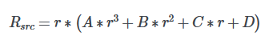

Here’s a draft for your README file:

---

# Interactive Image Tool with Streamlit

This project is a lightweight interactive image processing tool built using Python and [Streamlit](https://streamlit.io/), enabling users to detect pixel coordinates and apply various image distortions, including barrel distortion, pincushion distortion, cylinder-to-plane transformations, and more.

## Features

- **Pixel Coordinate Detection**: Click on the image to retrieve pixel coordinates, even for large images. The app automatically resizes images that exceed a height of 740 pixels.
- **Image Distortion Effects**:
  - Barrel distortion
  - Pincushion distortion
  - Cylinder-to-plane and plane-to-cylinder transformations
  - Perspective skew
  - Compound distortion: Stack and combine multiple distortions for complex effects.
- **Support for Image Uploads**: Choose between preloaded images (grid or dog) or upload a custom image.
  
## Technologies Used

- **Python**
- **Streamlit**: Used for creating the web interface.
- **Pillow (PIL)**: For basic image processing.
- **NumPy**: Image array manipulation.
- **Wand**: Handling image distortions.
- **Matplotlib**: For graphical plotting (future expansion).
- **Scikit-image**: Image I/O and additional processing.
- **streamlit-image-coordinates**: Used for pixel coordinate detection.

## Installation

1. Clone this repository:
    ```bash
    git clone https://github.com/chaseelliottpatterson/interactive-image-tool
    cd interactive-image-tool
    ```

2. Install the required dependencies:
    ```bash
    pip install -r requirements.txt
    ```

3. Run the app:
    ```bash
    streamlit run app.py
    ```

## Usage

1. **Image Selection**: Choose from preloaded images or upload your own.
2. **Pixel Measurements**: Activate the “Image Pixel Information” tool to interactively detect pixel coordinates.
3. **Apply Distortions**: Enable and tweak various distortion effects, such as barrel or pincushion distortion. Use sliders to adjust distortion parameters.
4. **View Distorted Images**: The app displays the transformed image with the applied effects.
5. **Compound Distortions**: Enable multiple distortions simultaneously to achieve compounded effects.

## Example Distortions

### Barrel Distortion:


### Pincushion Distortion:


## Customization

The app allows you to further customize how images are processed. You can:

- Select specific pixels for distortion points.
- Adjust advanced settings, such as lens and field of view for cylindrical distortions.
- Apply multiple distortions in sequence to create complex transformations.

## Contributing

Feel free to open issues or submit pull requests for bug fixes, enhancements, or additional features.

## License

This project is licensed under the MIT License.
